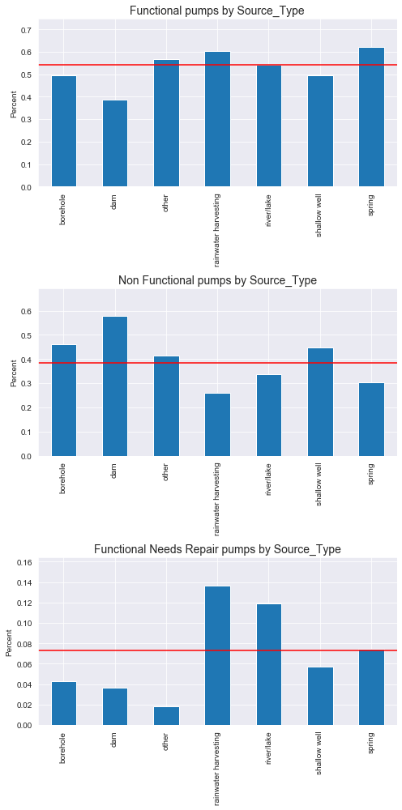
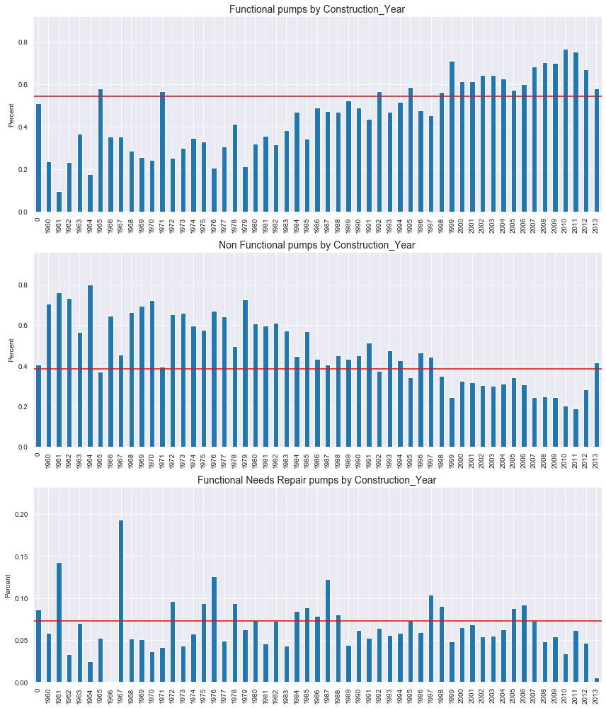
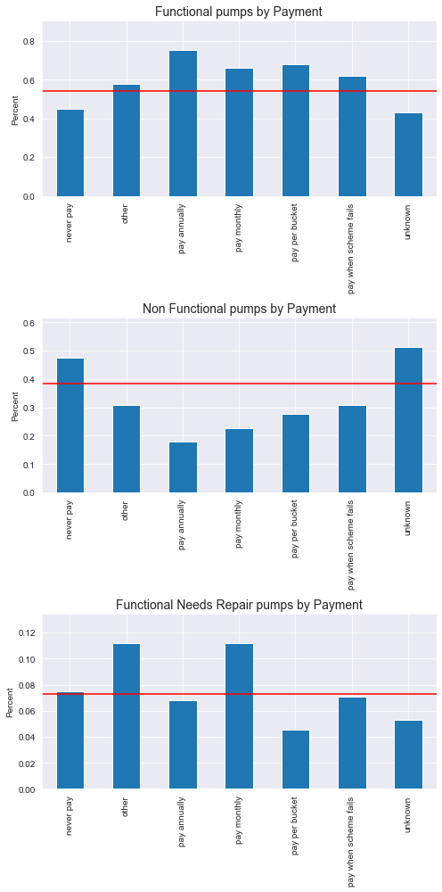

# Tanzania: Data Mining the Water Table
------------

### About
According to Tanzania’s Ministry of Water, more than 74,000 such pumps can be found throughout the country. While the installation of these pumps is largely funded via contributions from charitable and other non-governmental organizations (NGO’s), their ongoing maintenance is typically the responsibility of the local community within which they reside. Unfortunately, the cost of maintaining the pumps is often beyond the means of the local community, resulting in pumps becoming non-functional. Furthermore, local communities are often unaware of the need to perform the required maintenance due to the apparent lack of any significant problems with a pump up until the point it ultimately fails.

### Questions
Through this analysis we are going to answer some of the questions as below:
1. Does source of water have an effect on the functionality of the wells?
2. Does Age effect the condition of the wells?
3. What is the best mode of payment for maintainence of wells?

### Purpose
The purpose of this project is to use classification to predict the operating condition of a waterpoint for each record in the dataset. 

Using data from Taarifa and the Tanzanian Ministry of Water, we will predict which pumps are functional, which need some repairs, and which don't work at all. 

Predict one of these three classes based on a number of variables about what kind of pump is operating, when it was installed, and how it is managed. 

A smart understanding of which waterpoints will fail can improve maintenance operations and ensure that clean, potable water is available to communities across Tanzania.

### Presentation
Online powerpoint style presentation:

[Click here for online non-technical presentation]('https://spark.adobe.com/page/F2QB7NfYVq811/')

### Data
This dataset is part of an ongoing competition located at ['https://www.drivendata.org'](https://www.drivendata.org/competitions/7/pump-it-up-data-mining-the-water-table/page/23/).

## Project Outline
------------

    ├── LICENSE
    ├── README.md                  <- The project layout (this file)
    ├── data
    │   ├── images                 <- For README.md and presentation
    │   └── raw                    <- The original, immutable data dump
    │
    ├── notebooks                  <- Jupyter notebooks
    │   ├── research.ipynb         <- Process for researching problem domain
    │   ├── obtain.ipynb           <- Process for obtaining data
    │   ├── scrub.ipynb            <- Process for cleaning the data
    │   ├── eda.ipynb              <- Process for exploring and analyzing the data
    
    │   └── model.ipynb            <- Process for modeling
    │
    ├── reports                    <- Reports and presentations
    │   ├── presentation.pdf       <- Non-technical presentation
    │   ├── blog.md                <- Blog post
    │   └── video_walkthrough      <- Link to video walkthrough
    │
    ├── requirements.txt           <- The requirements file for reproducing the analysis environment
    │
    └── src                        <- Source code for use in this project.
   

--------

## Recommendations
------------

1. Does source of water have an effect on the functionality of the wells?

It is clear from the graphs that the water source does have a strong effect on the functionality of the wells. 

Spring and rainwater harvesting water sources have the most functioning pumps, while pumps that are supplied by dams or shallow wells are more frequently non functional.

2. Does Age effect the condition of the wells?

The construction year graphs show strong linear correlations with the functionality of the pumps. For example, the older the pump is, the more likely it is to be non-functional, and the newer the pump, the more likely it is to be functional.

This is exactly what we would expect, but it is always nice to see the data to confirm our assumptions.

3. What is the best mode of payment for maintainence of wells?

The two most beneficial payment options for keeping a pump functional are 'pay annually', or to 'pay per bucket'.

The options that lead to above average 'non functional' status are 'never pay' and 'unknown'. The 'never pay' options makes sense, because there is no money to pay for repairs and maintenance on the water pump.

## Conclusions
------------
Groundwater is very important to maintain the functionality of the wells. The wells are completely dependent on the different water sources, especially ground water.

We would look into different methods such as rainwater harvesting and soil conservation which would also help sustain more water in the lakes.

We see that when we make payment based on bucket or monthly payment, the wells are maintained better. So payment is an important factor.

Age of the wells is an important factor to predict the functionality of the wells. The newer the wells are, more water they have or better is their condition.

We can see that having a public meeting helps in functioning of the wells. More than 50% wells are functional when there is a public meeting held for the same. Thus, Public meeting is an important factor for the functioning of wells.

Further send out designated people to inspect the pumps detected by the model and assess what needs to be done.